# Tugas Besar 1 - Pengembangan Aplikasi Berbasis Web


## **Deksripsi Web App - Web App Description**

LinkinPurry adalah platform inovatif yang dirancang khusus untuk menghubungkan para agen O.W.C.A. dengan peluang kerja yang sesuai dengan keahlian mereka. Seperti LinkedIn, aplikasi ini berfungsi sebagai jembatan antara pencari kerja dan perusahaan, menyediakan lingkungan yang intuitif dan efisien untuk menjelajahi dan melamar lowongan pekerjaan. Dengan tampilan yang ramah pengguna dan fitur yang kaya, LinkinPurry bertujuan untuk mempermudah para agen dalam menemukan pekerjaan impian mereka dan membantu perusahaan menemukan bakat terbaik.

## **Daftar Kebutuhan - Requirements List**

1. **Jenis Pengguna**:  
   Terdapat dua jenis pengguna: job seeker dan company.

2. **Autentikasi**:

   - Pengguna harus melakukan autentikasi untuk mengakses seluruh fitur, kecuali yang disebutkan untuk pengguna tidak terautentikasi.
   - Semua pengguna terautentikasi dapat melakukan logout.

3. **Pendaftaran**:  
   Pengguna dapat mendaftar sebagai company atau job seeker.

4. **Fitur untuk Company**:

   - Mengubah profil perusahaan.
   - Melihat daftar lowongan kerja yang dibuka.
   - Membuat, mengubah, menghapus, dan menutup lowongan kerja.
   - Melihat daftar pelamar dan menerima/menolak pelamar dengan alasan.

5. **Fitur untuk Job Seeker**:

   - Melihat dan mencari daftar lowongan.
   - Memfilter lowongan berdasarkan jenis pekerjaan dan lokasi.
   - Menyortir lowongan berdasarkan waktu posting.
   - Melamar pekerjaan dan melihat riwayat lamaran.

6. **Akses Pengguna Tidak Terautentikasi**:  
   Dapat melihat daftar lowongan, namun tidak dapat melakukan aksi lainnya.

## **Cara Menginstall dan Menjalankan Program - How to Install and Run The Program**

1. Clone this repository

```sh
https://github.com/Labpro-21/if3110-tubes-2024-k01-14.git
```

2. Change the current directory to `if3110-tubes-2024-k01-14`

```sh
cd if3110-tubes-2024-k01-14
```

3. Copy .env.example and change the name of the new copy to .env

4. Build and run your docker containers

```sh
docker compose up --build
```

5. Run the server in your localhost with port 8000

```sh
http://localhost:8000/
```

6. Seed your database by visiting /seed route. Wait a couple of minutes, it should show a "Seeding Successful" message if success.

```sh
http://localhost:8000/seed
```   

7. Other alternative is by using SQL seeder. move seeder files from /seed to /db and then perform docker compose up (docker compose down first if you have started your docker)
```sh
docker compose up
```     

## Endpoints

### General

| Endpoint        | Deskripsi                                 | Body          | Param |
| --------------- | ---------------------------------------   | ------------- | ----- |
| GET `/`         | Tampilan home (Company / Jobseeker)       | -             | -     |
| GET `/login`    | Page login                                | -             | -     |
| GET `/register` | Page register                             | -             | -     |
| GET `/not-found`| Page Not Found                             | -             | -     |
| GET `/storage/cv/:file`| Page CV Pelamar                            | -             | `filename`     |
| GET `/storage/video/:file`| Page Video Perkenalan Pelamar                             | -             | `filename`     |
| POST `/login`   | Menghandle request login dari pengguna    | `credentials` | -     |
| POST `/register`| Menghandle request register pengguna baru | `data pengguna` | -     |
| POST `/logout`  | Menghandle request logout dari pengguna   | -             | -     |
| GET `/seed` | Seeding Database                             | -             | -     |


### Company

#### FrontEnd

| Endpoint                | Deskripsi                    | Body | Param           |
| ----------------------- | ---------------------------- | ---- | --------------- |
| GET `/jobs/add`         | Page Tambah Lowongan         | -    | -               |
| GET `/jobs/edit/:id`    | Page Edit Lowongan           | -    | `jobId`         |
| GET `/jobs/:id`         | Page Company Detail Lowongan | -    | `jobId`         |
| GET `/applications/:id` | Page Company Detail Lamaran  | -    | `applicationId` |
| GET `/profile/company`  | Page Company Detail Lamaran  | -    | -               |

#### Backend

| Endpoint                        | Deskripsi                   | Body                                                                  | Param           |
| ------------------------------- | --------------------------- | --------------------------------------------------------------------- | --------------- |
| POST `/jobs`                    | Menambah lowongan baru      | `posisi`,`deskripsi`,`jenis_pekerjaan`,`jenis_lokasi`,`attachment(s)` | -               |
| POST `/jobs/:id`                 | Mengedit lowongan           | `posisi`,`deskripsi`,`jenis_pekerjaan`,`jenis_lokasi`,`attachment(s)` | `jobId`         |
| POST `/jobs/:id/delete`                 | Menghapus lowongan           | `posisi`,`deskripsi`,`jenis_pekerjaan`,`jenis_lokasi`,`attachment(s)` | `jobId`         |
| PUT `/applications/:id/approve` | Approve suatu lamaran       | -                                                                     | `applicationId` |
| PUT `/applications/:id/reject`  | Reject suatu lamaran        | -                                                                     | `applicationId` |
| PUT `/profile/company`          | Mengedit Profile Company | `nama`,`lokasi`,`about`                                               | -               |
| POST `/jobs/:id/close`          | Mengubah status open Lowongan | -                                               | `jobId`               |
| GET `/jobs/:id/export` | Download export data lamaran | - | `jobId` |

### Job Seeker

#### FrontEnd

| Endpoint                | Deskripsi                      | Body | Param   |
| ----------------------- | ------------------------------ | ---- | ------- |
| GET `/jobs/:id/details` | page Jobseeker Detail Lowongan | -    | `jobId` |
| GET `/jobs/:id/apply`   | Page Form Lamaran              | -    | `jobId` |
| GET `/applications`     | Page Riwayat lamaran           | -    | -       |

#### Backend

| Endpoint               | Deskripsi              | Body         | Param   |
| ---------------------- | ---------------------- | ------------ | ------- |
| POST `/jobs/:id/apply` | Menambah lowongan baru | `CV`,`video` | `jobId` |

## **Screenshots of Application with Lighthouse**
1. <strong>Halaman Login</strong>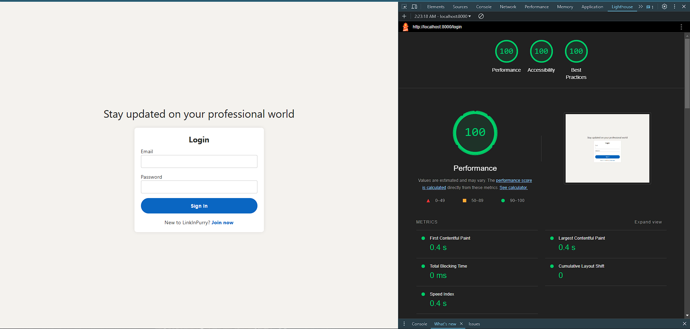<br/><br/><br/>
2. <strong>Halaman Register</strong>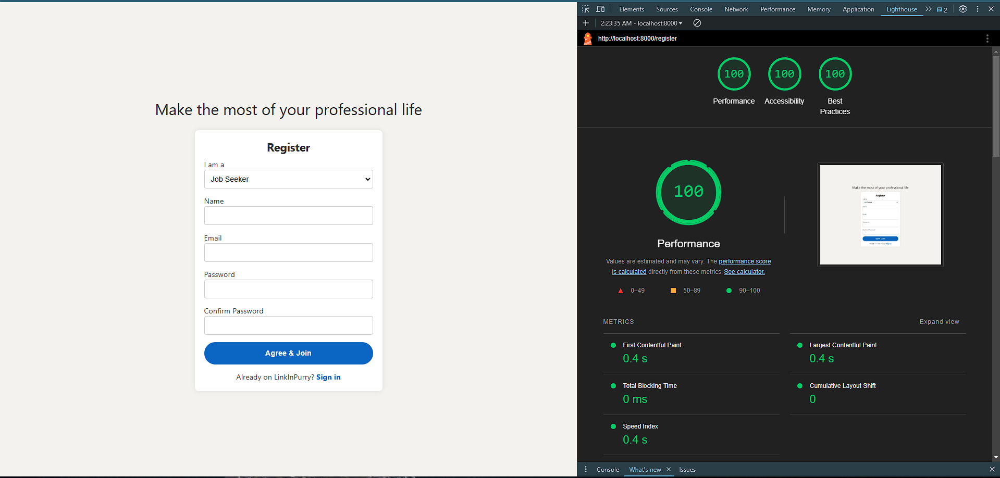<br/><br/><br/>
3. <strong>Halaman Home (Job Seeker)</strong>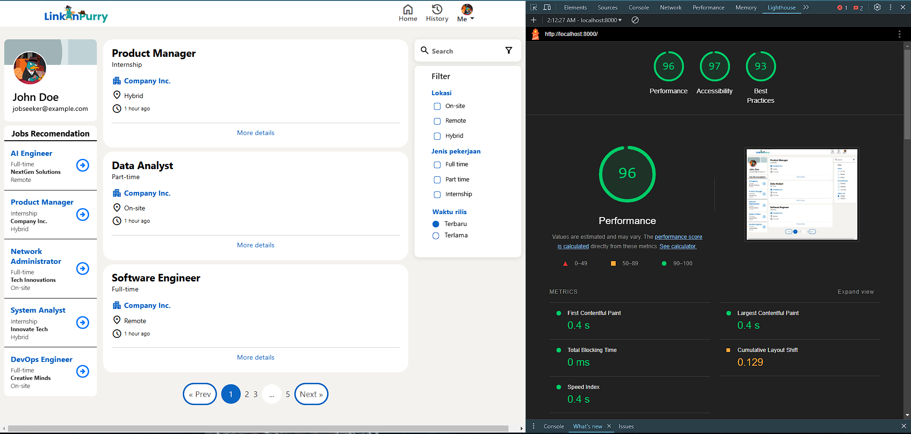<br/><br/><br/>
4. <strong>Halaman Home (Company)</strong>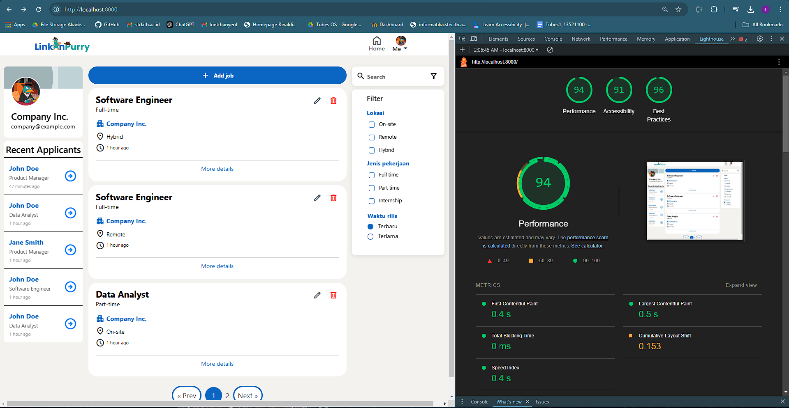<br/><br/><br/>
5. <strong>Halaman Tambah Lowongan (Company)</strong>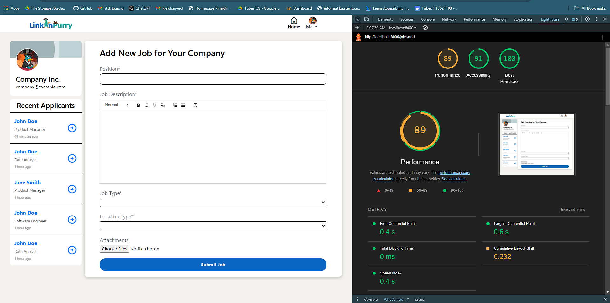<br/><br/><br/>
6. <strong>Halaman Detail Lowongan (Company)</strong>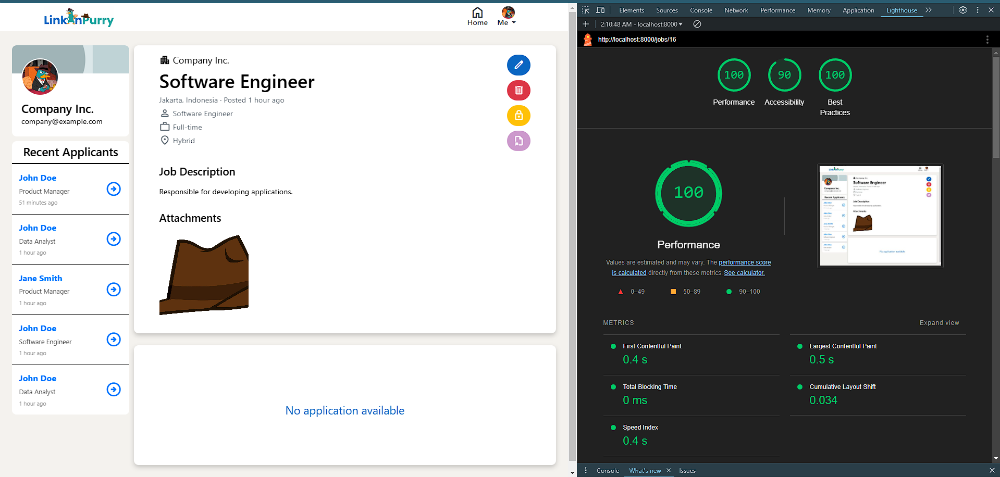<br/><br/><br/>
7. <strong>Halaman Detail Lamaran (Company)</strong>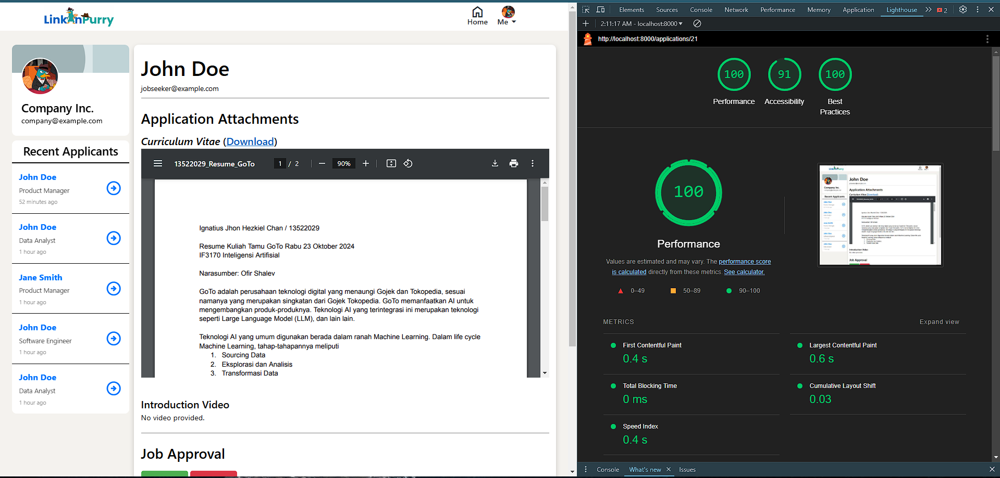<br/><br/><br/>
8. <strong>Halaman Edit Lowongan (Company)</strong>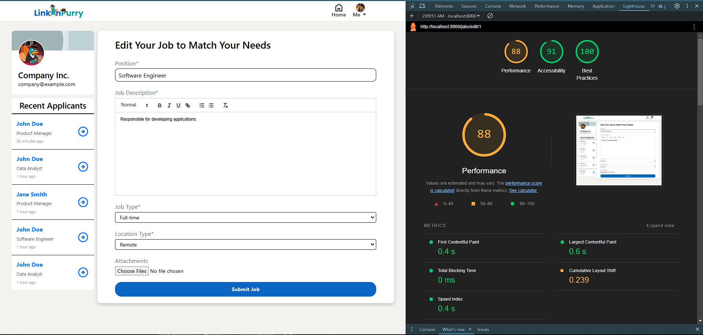<br/><br/><br/>
9. <strong>Halaman Detail Lowongan (Job Seeker)</strong>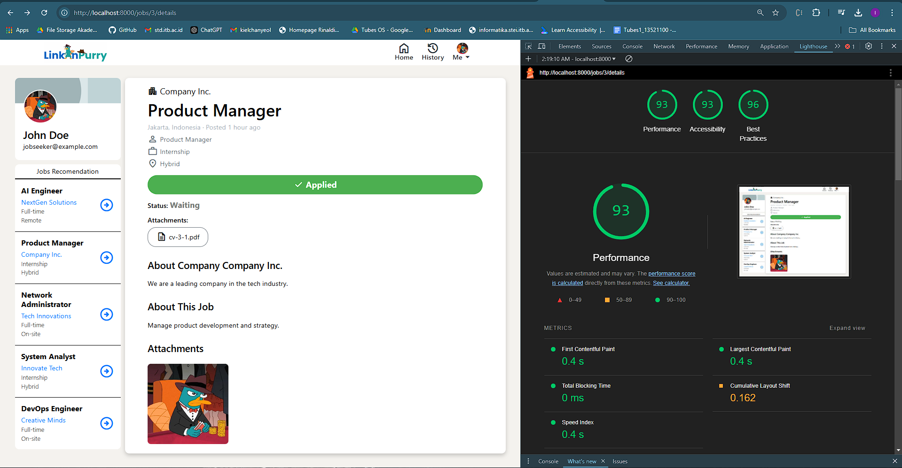<br/><br/><br/>
10. <strong>Halaman Lamaran (Job Seeker)</strong>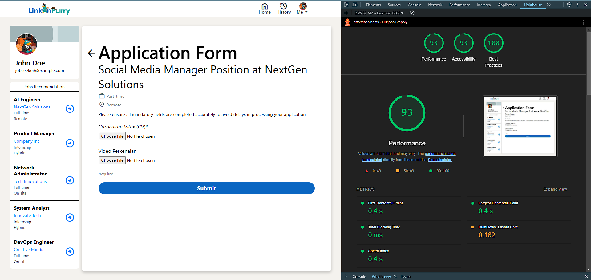<br/><br/><br/>
11. <strong>Halaman Riwayat (Job Seeker)</strong>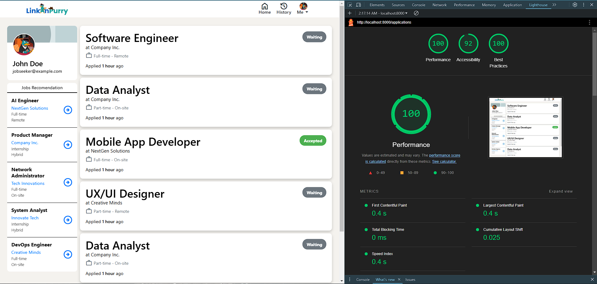<br/><br/><br/>
12. <strong>Halaman Profil (Company)</strong>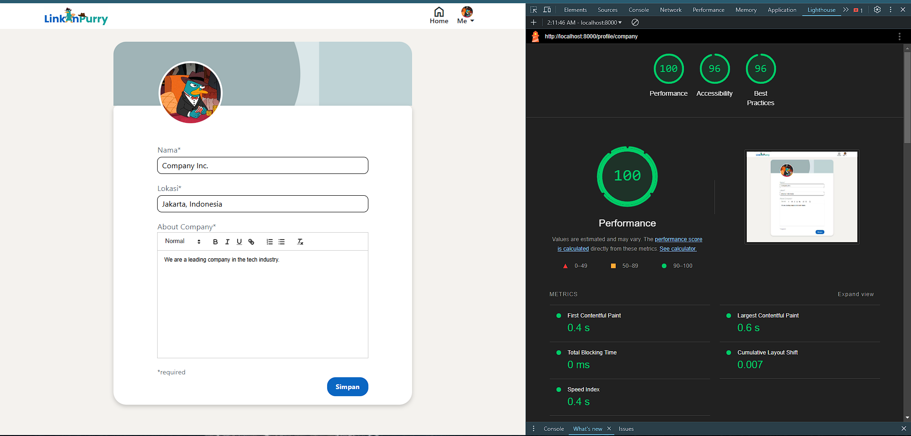<br/><br/><br/>

## **Bonus yang dikerjakan**

1. All Responsive Web Design
2. UI/UX seperti LinkedIn
3. Data Export
4. Simple Job Recommendation
5. Google Lighthouse

## **Pembagian Kerja - Workload Breakdown**

**Anggota Kelompok**

| Nama            | NIM      | Panggilan |
| --------------- | -------- | --------- |
| Ignatius Jhon Hezkiel Chan | 13522029 | Kiel     |
| Imam Hanif Mulyarahman  | 13522030 | Imam     |
| Francesco Michael Kusuma   | 13522038 | Fransesco   |

**Server Side:**
| Fitur | Nim |
|----------------------|----------|
| Login, Logout        | 13522038 |
| Register             | 13522038 |
| Search, Sort, Filter | 13522038 |
| Model User           | 13522038 |
| Model Lowongan       | 13522029, 13522030 |
| Model Lamaran        | 13522029, 13522030 |
| Controller User      | 13522038 |
| Controller Lowongan  | 13522029, 13522030 |
| Controller Lamaran   | 13522029 |
| Routing              | 13522029 |
| Abstraksi Database   | 13522029 |
| Abstraksi Storage    | 13522029 |
| Data Export          | 13522038 |

**Client Side:**
| Fitur | Nim |
|----------------------|----------|
| Login | 13522038 |
| Register | 13522038 |
| Home (Job Seeker) | 13522038 |
| Detail Lowongan (Job Seeker) | 13522029 |
| Form Lamaran | 13522029 |
| Riwayat Lamaran | 13522029 |
| Home (Company) | 13522038 |
| Detail Lowongan (Company) | 13522030, 13522029 |
| Detail Lamaran | 13522030, 13522029 |
| Tambah Lowongan | 13522030, 13522029 |
| Edit Lowongan | 13522030, 13522029 |
| Profile Company | 13522029 |